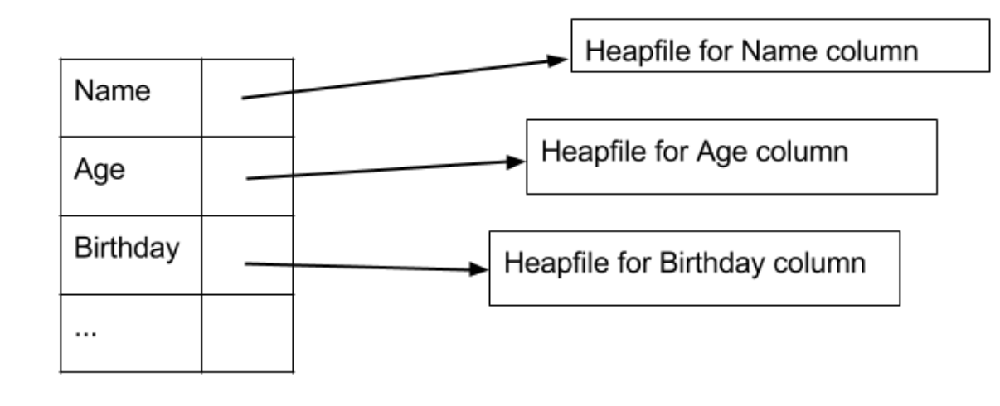
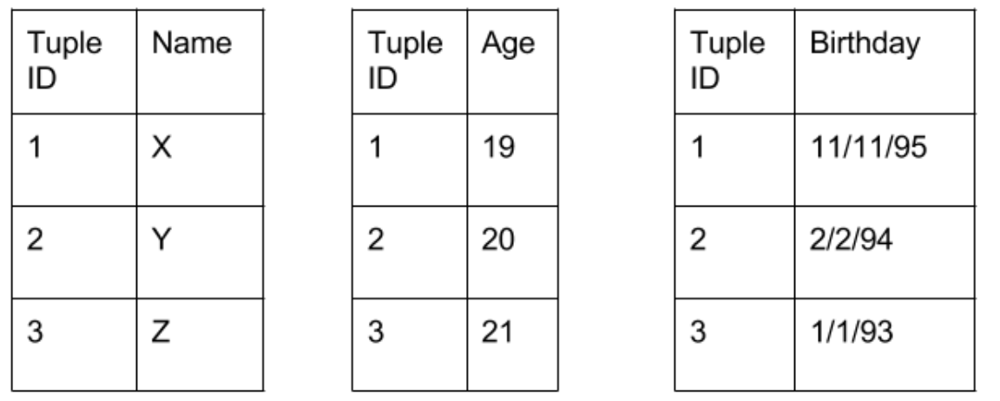

# Relational Data layout on disk
We implemented a library containing functions to store and maintain relational data on disk using _heap file_ data structure. We implemented and experimented two different file formats corresponding to a _row store_ and a _column store_ 

collaborated with [Playjasb2](https://github.com/Playjasb2)

----
### Table of Contents
1. [Record Serialization](#1-record-serialization)
2. [Page layout](#2-page-layout)
3. [Heap file](#3-heap-file)
4. [Column Store](#4-column-store)

### 1 Record Serialization
Before we start record serialization, we assume that records are maps mapping attribute names to values. The attribute names are stored as part of the schema, which will not be stored as part of the record serialization.

This means we abstract record as a tuple of values.

```C++
#include <vector>
typedef const char* V;
typedef std::vector<V> Record;
```

We implemented a serialization of fixed length records in the following functions:
```C++
/**
 * Compute the number of bytes required to serialize record
 */
int fixed_len_sizeof(Record *record);

/**
 * Serialize the record to a byte array to be stored in buf.
 */
void fixed_len_write(Record *record, void *buf);
```

and a Desrialization function as follows:
```c++
/**
 * Deserializes `size` bytes from the buffer, `buf`, and
 * stores the record in `record`.
 */
void fixed_len_read(void *buf, int size, Record *record);
```

_We assumed there was only one table in schema and there are 100 attributes, and each attribute is 10 bytes each. So, records in the table are fixed length._

### 2 Page layout

As we know, it is critical for all disk I/O to be done in units of blocks, known as _pages_. In this section, we experiment with storing serialized records in pages.

#### Storing fixed length records in pages
We used a slotted directory based page layout to store fixed length records.
```c++
typedef struct {
    void *data;
    int page_size;
    int slot_size;
} Page;
```

Functions implemented:
```c++
/**
 * Initializes a page using the given slot size
 */
void init_fixed_len_page(Page *page, int page_size, int slot_size);
 
/**
 * Calculates the maximal number of records that fit in a page
 */
int fixed_len_page_capacity(Page *page);
 
/**
 * Calculate the free space (number of free slots) in the page
 */
int fixed_len_page_freeslots(Page *page);
 
/**
 * Add a record to the page
 * Returns:
 *   record slot offset if successful,
 *   -1 if unsuccessful (page full)
 */
int add_fixed_len_page(Page *page, Record *r);
 
/**
 * Write a record into a given slot.
 */
void write_fixed_len_page(Page *page, int slot, Record *r);
 
/**
 * Read a record from the page from a given slot.
 */
void read_fixed_len_page(Page *page, int slot, Record *r);
```

### 3 Heap file

After completing the above designed and coded abstract functions, we are ready to generate and maintain _heap files_. 
A heap file is just paginated file. Each page is to store a series of records.
```c++
typedef struct {
    FILE *file_ptr;
    int page_size;
} Heapfile
``` 

We assume the following way to assign unique identifiers to records in the heap file:
- Every page `p` has an entry in the heap directory of `(page_offset, freespace)`. The page ID of `p` can be the index of its entry in the directory. We call this: `ID(p)`.
- Every record `r` is stored at some slot in some page `p`. The record ID, `ID(r)` is the contenation of ID(p) and the slot index in `p`.

#### Functions

We implemented a directory based heap file in which we have directory pages (organized as a linked list), and data pages that store records.
```c++
/**
 * Initalize a heapfile to use the file and page size given.
 */
void init_heapfile(Heapfile *heapfile, int page_size, FILE *file);

/**
 * Allocate another page in the heapfile.  This grows the file by a page.
 */
PageID alloc_page(Heapfile *heapfile);

/**
 * Read a page into memory
 */
void read_page(Heapfile *heapfile, PageID pid, Page *page);

/**
 * Write a page from memory to disk
 */
void write_page(Page *page, Heapfile *heapfile, PageID pid);

```
The central functionality of a heap file is enumeration of records. Implement the record iterator class:
```c++
class RecordIterator {
    public:
    RecordIterator(Heapfile *heapfile);
    Record next();
    bool hasNext();
}
```

#### File Operations
Operations available are:

```bash
# Build heap file from CSV file
$ csv2heapfile <csv_file> <heapfile> <page_size>

# Print out all records in a heap file
$ scan <heapfile> <page_size>

# Insert all records in the CSV file to a heap file
$ insert <heapfile> <csv_file> <page_size>

# Update one attribute of a single record in the heap file given its record ID
# <attribute_id> is the index of the attribute to be updated (e.g. 0 for the first attribute, 1 for the second attribute, etc.)
# <new_value> will have the same fixed length (10 bytes)
$ update <heapfile> <record_id> <attribute_id> <new_value> <page_size>

# Delete a single record in the heap file given its record ID
$ delete <heapfile> <record_id> <page_size>
```

### 4 Column Store
A column-oriented DBMS (or Column Store), stores all values of a single attribute (column) together, rather than storing all values of a single record together. Hence, the main abstract they use is of columns-of-data rather than rows-of-data. Most DBMS are row-oriented, but depending on the workload, column-oriented DBMS may provide better performance. Below is an illustration of column store (left) and row-store (right).


Consider a query that returns all values of the attribute Name. In a column store you only need to retrieve Name values from the file. In constract, in when using row-oriented storage, to find the Name value of a record, you are necessarily retrieving all attribute values in the record. Hence, to return all values of the Name attribute, you need to read the entire table. The drawback of column store is you that you need to do extra work to reconstruct the tuple. Suppose you wish to return the Name and Salary values from a table. To be able to reassemble records, a column-oriented DBMS will store the tuple id (record-id) with each value in a column.

Column-oriented storage has advantages for queries that only access some of the attributes of a table. However, insertion and deletion now may require multiple page accesses as each tuple is no longer stored on a single page

We implemented a simplified version of columnn store using exisitng heap file implementation. Our implementation will have a separate heap file for each column of a table.


We will use the same fixed table schema (100 attributes, 10 bytes each). For each attribute, we created a separate heap file. We named the heap file with the same name as the attribute id. We placed all attribute heap files in a single file directory. This is a simplification to make the bookkeeping on what files are in a relation simpler. Think about the limitations of the simplification.

Tuple reconstruction: Different attributes of a tuple will be in different heap file. So, we need to reconstruct the tuple (part of the tuple) to get the result of a query. We can store the tuple-id with each field. Two attributes will have the same tuple-id if they belong to the same tuple.


#### Column-Oriented file operations

We implemented thhe following operations as follows:
```sh
# Build a column store from CSV file
# <colstore_name> should be a file directory to store the heap files
$ csv2colstore <csv_file> <colstore_name> <page_size>

# Select a single attribute from the column store where parameter
# <attribute_id> is the index of the attribute to be project and returned (e.g. 0 for the first attribute, 1 for the second attribute, etc.)
# the value of the attribute must be between <start> and <end> 
$ select2  <colstore_name> <attribute_id> <start> <end> <page_size>
```
This performs the following parameterized SQL query.  Note that the selection predicate is on the same attribute that is returned by the query:
```sql
SELECT SUBSTRING(A, 1, 5) FROM T
    WHERE A >= start AND A <= end
```

Another function 
```sh
# Select only a single attribute from the column store where parameter
# <return_attribute_id> (B) is the index of an attribute to be projected and returned 
# <attribute_id> (A) is the index of (a possibly different) attribute whose value must be between  <start> and <end> 
$ select3  <colstore_name> <attribute_id> <return_attribute_id> <start> <end> <page_size>
```
performs thhe following parameterized SQL Query:
```sql
SELECT SUBSTRING(B, 1, 5) FROM T
    WHERE A >= start AND A <= end
```